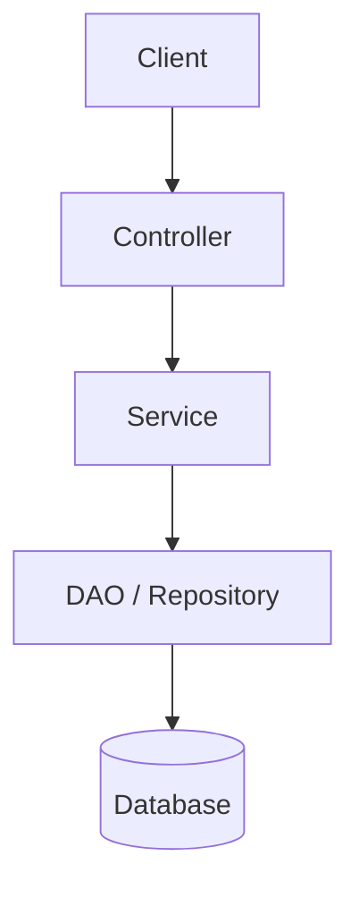
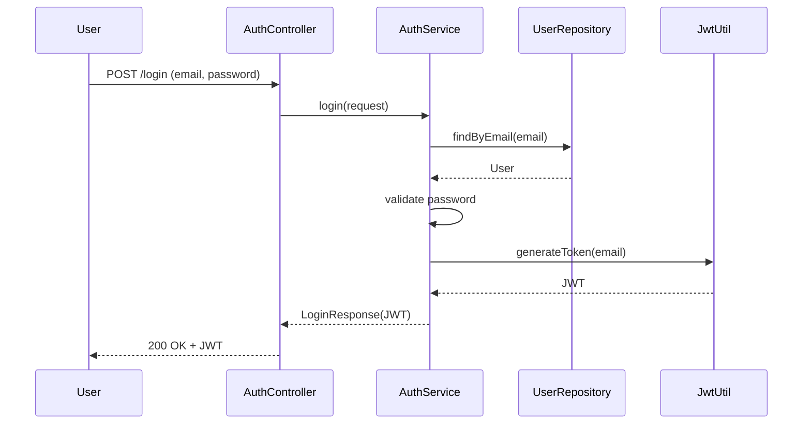
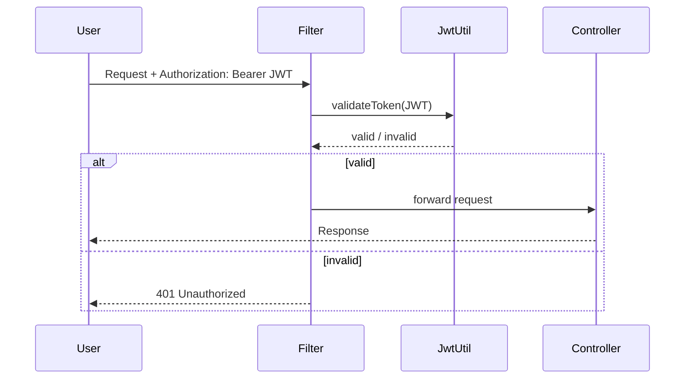
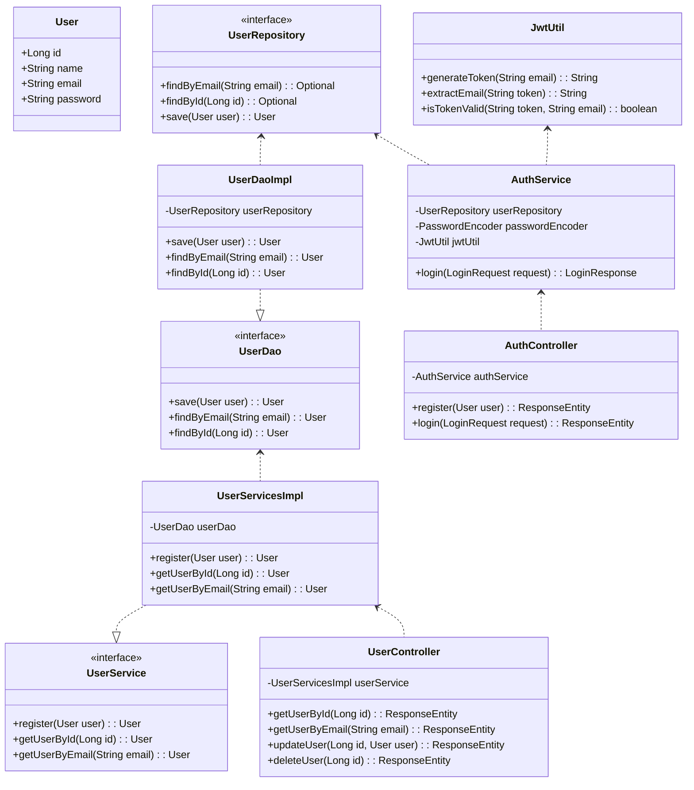
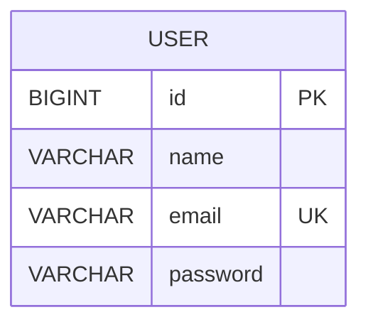

---

# User Service – Spring Boot

A simple **User Service** built with Spring Boot.
Supports **user registration, login, and JWT-based authentication**.
This project can be extended into a microservice architecture.

---

## 📌 Features

* User Registration API
* User Login API with JWT generation
* JWT Validation for secured endpoints
* Layered Architecture (Controller → Service → DAO → Repository → DB)
* Spring Security integration

---

## 🏗️ High-Level Architecture



---

## 🔑 Login Flow (JWT Generation)



---

## 🔒 Secured API Flow (JWT Validation)



---

## 🎭 Use Case Diagram

```mermaid
usecaseDiagram
    actor User as "End User"

    User --> (Register New User)
    User --> (Login with Email & Password)
    User --> (Access Secured APIs)

    (Login with Email & Password) --> (Receive JWT Token)
    (Access Secured APIs) --> (JWT Token Validation)
```

---

## 📐 Class Diagram (UML)



---

## 🗄️ ER Diagram (Database Schema)



---

## 🚀 Running the Project

### Prerequisites

* Java 17+
* Maven / Gradle
* Local MySQL or PostgreSQL DB

### Steps

1. Clone the repo
2. Configure DB credentials in `application.properties`
3. Run:

   ```bash
   mvn spring-boot:run
   ```
4. Test APIs using Postman or curl

---
